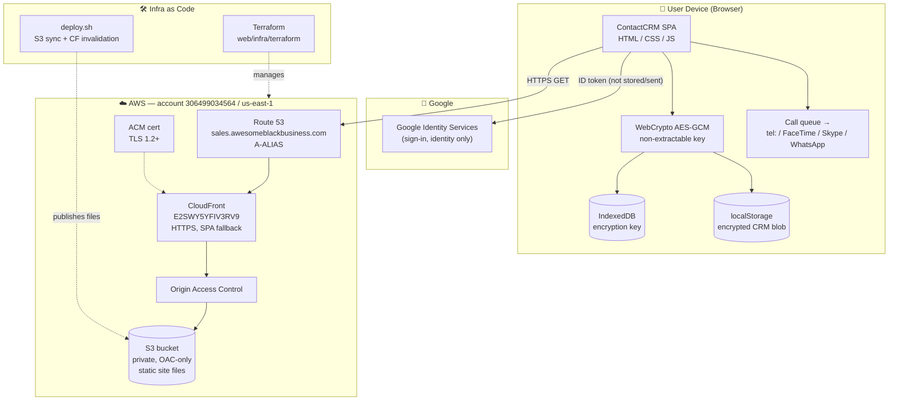

# ContactCRM — Infrastructure & Architecture

Live site: **https://sales.awesomeblackbusiness.com**
Infrastructure as code: [`web/infra/terraform`](./terraform) · Content deploys: [`web/deploy.sh`](../deploy.sh)

## Diagram

## How it fits together

| Layer | Component | Notes |
|---|---|---|
| **DNS** | Route 53 `A`-ALIAS | `sales.awesomeblackbusiness.com` → CloudFront (zone `ZQKDSIZ3XJDSM`) |
| **CDN / TLS** | CloudFront `E2SWY5YFIV3RV9` | HTTPS redirect, TLS 1.2+, SPA 403→`/index.html` fallback |
| **Certificate** | ACM (us-east-1) | DNS-validated for the domain |
| **Origin** | S3 bucket `sales.awesomeblackbusiness.com` | Private; reachable only via CloudFront Origin Access Control |
| **Auth** | Google Identity Services | Sign-in for identity only; the ID token is decoded client-side and never stored or sent to a server |
| **Data** | Browser `localStorage` + WebCrypto | Whole CRM document AES-GCM encrypted; key is a non-extractable `CryptoKey` in IndexedDB |
| **Dialing** | Device app URL schemes | `tel:` / FaceTime / Skype / WhatsApp — launched by the browser, connected by one user tap |

## Trust boundaries

- **Nothing leaves the browser** except static-asset fetches from CloudFront and
  the Google sign-in exchange. There is no application backend and no network
  entitlement for CRM data.
- **CRM data at rest** is encrypted in `localStorage`; the key never exists in
  script-readable form.
- **S3 is never public** — only CloudFront (via OAC) can read objects.

## Change management

- **Infrastructure** changes → edit [`terraform/main.tf`](./terraform/main.tf), `terraform apply`.
- **Site content** changes → run [`web/deploy.sh`](../deploy.sh) (S3 sync + CloudFront invalidation).
